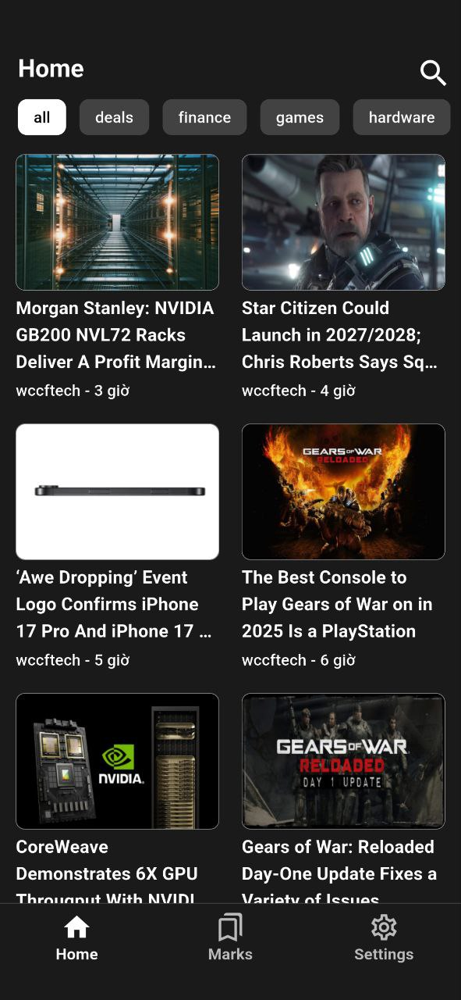
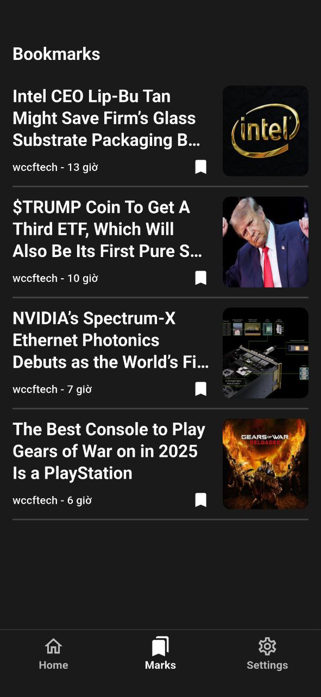
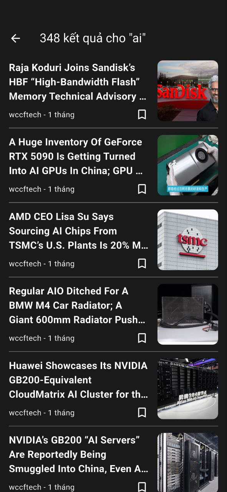
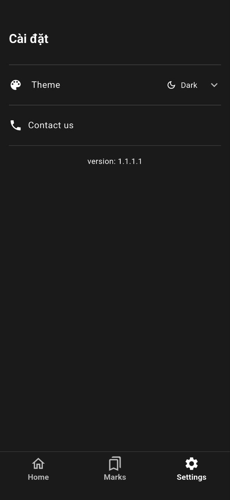

# 📚 Flutter Article App

A simple yet powerful Flutter application for reading and managing articles.

---

## 🚀 Getting Started

This project is a starting point for a Flutter application.

Some useful resources to get you started:

- [Lab: Write your first Flutter app](https://docs.flutter.dev/get-started/codelab)  
- [Cookbook: Useful Flutter samples](https://docs.flutter.dev/cookbook)  
- [Flutter Documentation](https://docs.flutter.dev/) — tutorials, samples, and full API reference.

---

## 📸 Application Preview

<table>
  <tr>
    <td align="center">
      <b>🏠 Home Screen</b>  
      
    </td>
    <td align="center">
      <b>📖 Read Screen</b>  
      
    </td>
  </tr>
  <tr>
    <td align="center">
      <b>🔖 Mark Screen</b>  
      
    </td>
    <td align="center">
      <b>🔍 Search Screen</b>  
      
    </td>
  </tr>
  <tr>
    <td align="center">
      <b>⚙️ Setting Screen</b>  
      
    </td>
    <td align="center">
    </td>
  </tr>
</table>

---

## 📦 Features

✔️ Browse and read articles  
✔️ Save favorite articles  
✔️ Search by keywords  
✔️ Manage user settings  

---

## 🛠️ Tech Stack

- [Flutter](https://flutter.dev/)  
- [Dart](https://dart.dev/)  
- State management: **Bloc**  
- Firebase backend integration  

---

## 💖 Support

If you wanna get updates in next version, please give me a ⭐ to the repo 👍  

If you love my work and want to support, references me a part-time job, collaboration on an interesting project, or a good full-time job.  

Thank you so much 👍  

---

## 📄 License

This project is licensed under the MIT License.
