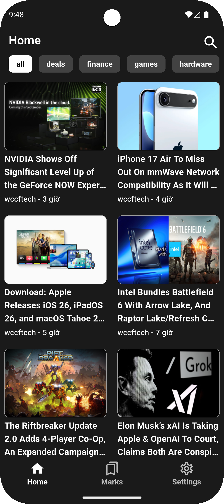

# flutter_article

A new Flutter project.

## Getting Started

This project is a starting point for a Flutter application.

A few resources to get you started if this is your first Flutter project:

- [Lab: Write your first Flutter app](https://docs.flutter.dev/get-started/codelab)
- [Cookbook: Useful Flutter samples](https://docs.flutter.dev/cookbook)

For help getting started with Flutter development, view the
[online documentation](https://docs.flutter.dev/), which offers tutorials,
samples, guidance on mobile development, and a full API reference.

##  Working application

<table>
  <tr>
    <th>Screen</th>
    <th>Preview</th>
    <th>Screen</th>
    <th>Preview</th>
  </tr>
  <tr>
    <td><strong>Home Screen</strong></td>
    <td></td>
    <td><strong>Read Screen</strong></td>
    <td></td>
  </tr>
  <tr>
    <td><strong>Mark Screen</strong></td>
    <td></td>
    <td><strong>Search Screen</strong></td>
    <td></td>
  </tr>
  <tr>
    <td><strong>Setting Screen</strong></td>
    <td></td>
    <td><strong>Register Screen</strong></td>
    <td></td>
  </tr>
</table>

